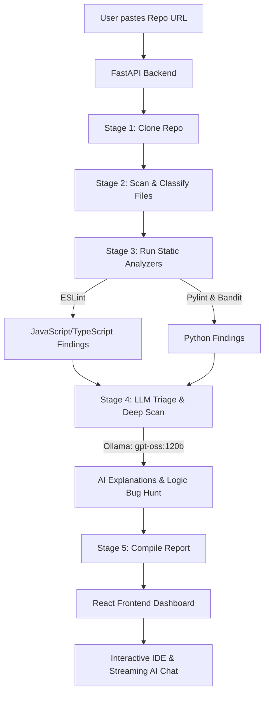

# 🔍 RepoScan (GitHub Scanner)

[](https://fastapi.tiangolo.com)
[](https://reactjs.org)
[](https://ollama.com)
[](https://opensource.org/licenses/MIT)

An interactive repository scanner and vulnerability analyzer that combines the speed of deterministic static analysis tools with the deep semantic understanding of local LLMs. 

Paste any public repository URL, watch the analysis pipeline run in real-time, and explore a comprehensive SonarQube-style report with AI-powered bug explanations, suggested fixes, and a built-in interactive IDE featuring a context-aware chat assistant.

---

## 📖 Table of Contents
- [✨ Key Features](#-key-features)
- [⚙️ Architecture & Workflow](#-architecture--workflow)
- [📋 Prerequisites](#-prerequisites)
- [🚀 Getting Started](#-getting-started)
  - [1. Backend Setup](#1-backend-setup)
  - [2. Frontend Setup](#2-frontend-setup)
- [💡 Usage Guide](#-usage-guide)
- [🛠️ Configuration](#️-configuration)
- [🧠 Under the Hood](#-under-the-hood)

---

## ✨ Key Features

*   **⚡ Hybrid Analysis Pipeline:** Blends deterministic static analysis (`ESLint`, `Pylint`, `Bandit`) for rapid issue detection with local LLM intelligence (`gpt-oss:120b`) for contextual triage.
*   **🛰️ Mission Control Progress Rail:** A real-time pipeline visualizer showing live stage progress: `queued` ➔ `cloning` ➔ `scanning` ➔ `analyzing` ➔ `triaging` ➔ `done`.
*   **📊 Rich Analytics Dashboard:** Comprehensive charts showing issue distribution, severity, language breakdown, file size ranking, and a density-based *"Fix These First"* prioritization list.
*   **💻 Integrated IDE & Code Viewer:** An interactive in-browser editor with a file tree explorer, syntax highlighting, and inline markers mapping directly to identified issues.
*   **💬 Context-Aware AI Chat:** An SSE-streaming chat interface next to the code editor. Ask the local LLM questions about the codebase, request explanations for specific bugs, or ask it to generate patches.
*   **📱 Mobile-Friendly Design:** A fully responsive UI that adapts to different screen sizes for seamless on-the-go repository scanning and triage.

---

## ⚙️ Architecture & Workflow



---

## 📋 Prerequisites

Before setting up, ensure you have the following installed:
*   **Python 3.10+**
*   **Node.js 18+**
*   **Git**
*   [**Ollama**](https://ollama.com) (installed and running)

Pull the recommended models in Ollama:
```bash
# Recommended for scan triage and deep logic review
ollama pull gpt-oss:120b

# Recommended for the interactive chat assistant
ollama pull qwen2.5-coder:7b
```
*(If `gpt-oss:120b` is too heavy for your local hardware, you can fall back to a lighter model like `qwen2.5-coder:7b` or `llama3`—see [Configuration](#️-configuration).)*

---

## 🚀 Getting Started

### 1. Backend Setup

The backend is built with FastAPI and orchestrates the cloning, analysis, and LLM communication.

```bash
# Navigate to the backend directory
cd backend

# Install Python dependencies
pip install -r requirements.txt

# Set up the headless ESLint runtime (one-time setup)
cd eslint_runtime
npm install
cd ..

# Start the FastAPI server using Uvicorn
python -m uvicorn app.main:app --host 0.0.0.0 --port 8000
```

The backend API will be running at `http://localhost:8000`. 

To verify Ollama connectivity, visit `http://localhost:8000/api/health` in your browser. You should see `"ollama_reachable": true`.

---

### 2. Frontend Setup

The frontend is built with React, Vite, and Vanilla CSS.

```bash
# Navigate to the frontend directory
cd frontend

# Install Node dependencies
npm install

# Start the Vite development server
npm run dev
```

Open the printed URL (usually `http://localhost:5173`) in your browser.

---

## 💡 Usage Guide

1.  **Start a Scan:** Paste a public GitHub, GitLab, or Bitbucket repository URL on the landing page and click **Scan Repository**.
2.  **Monitor Progress:** The **Mission Control** rail will show you exactly what the backend is doing in real-time.
3.  **Explore the Dashboard:**
    *   **Severity Summary:** Click on the **High**, **Medium**, or **Low** severity cards to filter findings.
    *   **Analytics Charts:** View language breakdowns, top violated rules, and largest files.
    *   **Fix These First:** Target files ranked by issue density (issues per 100 lines of code).
4.  **Inspect Code & Chat:**
    *   Click on any file to open the **IDE View**.
    *   Browse the file tree and click files to open them.
    *   Hover over highlighted lines in the code editor to view the static analysis error and the AI's explanation.
    *   Use the right-hand **AI Chat** panel to ask questions about the open file or the scan results.

---

## 🛠️ Configuration

You can customize the models and limits used by the application:

*   **Default Models:** Open [ollama_client.py](file:///c:/Study/Projects/Github_Scanner/backend/app/ollama_client.py) and modify:
    *   `DEFAULT_SCAN_MODEL`: The model used for explaining lint issues and conducting deep file scans (default: `"gpt-oss:120b"`).
    *   `DEFAULT_CHAT_MODEL`: The model powering the interactive IDE chat panel (default: `"qwen2.5-coder:7b"`).
*   **Deep Scan Limits:** To prevent long wait times on large repositories, the number of files analyzed during the LLM deep-scan phase is capped. You can change this limit by modifying the `deep_scan_limit` parameter in [pipeline.py](file:///c:/Study/Projects/Github_Scanner/backend/app/pipeline.py#L70).

---

## 🧠 Under the Hood

The analysis pipeline runs through six distinct stages:

1.  **Clone (`cloner.py`):** Performs a shallow `git clone --depth 1` into a temporary directory unique to the job.
2.  **Scan & Classify (`repo_walk.py`):** Traverses the repository, skipping ignored directories (e.g., `node_modules`, `.git`, `venv`, build outputs) and categorizes files by language.
3.  **Static Analysis (`static_analysis.py`):** Runs `pylint` and `bandit` on Python files, and `eslint` on JavaScript/TypeScript files.
4.  **LLM Triage (`ollama_client.py`):** Batches the static findings and sends them to the local Ollama instance. The LLM translates cryptic linter rules into plain English, suggests a fix, and verifies the severity.
5.  **LLM Deep Scan (`ollama_client.py`):** Selects the most critical/complex files and performs a full-file review looking for logic bugs (off-by-one errors, race conditions, unhandled exceptions) that static analyzers cannot detect.
6.  **Report Assembly (`pipeline.py`):** Merges, ranks, and structures all findings into a clean JSON payload consumed by the React frontend.
